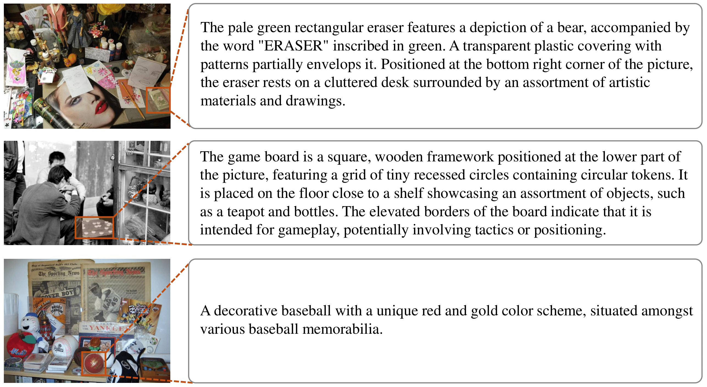
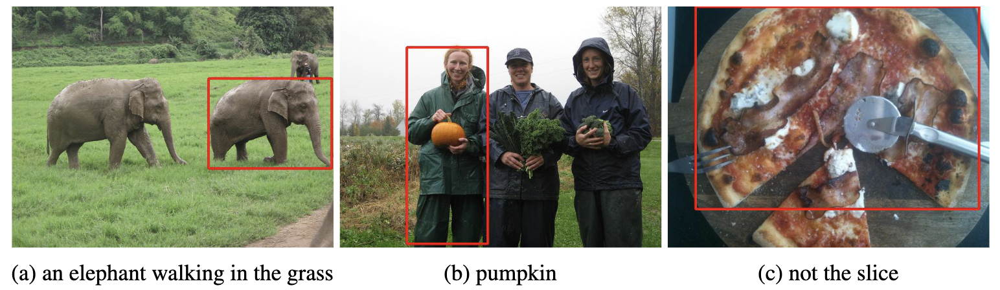

# Ref-L4: a New REC Benchmark in the LMM Era

This repository contains the data loader and evaluation code for our [Ref-L4](https://huggingface.co/datasets/JierunChen/Ref-L4), a new REC benchmark in the LMM era. Check out our paper [Revisiting Referring Expression Comprehension Evaluation in the Era of Large Multimodal Models](https://arxiv.org/abs/2406.16866) for more details.

## 🧭 Introduction  

Referring expression comprehension (REC) involves localizing a target based on a textual description. Recent advancements with large multimodal models (LMMs) like CogVLM have achieved high accuracy (92.44% on RefCOCO). However, existing benchmarks (RefCOCO, RefCOCO+, RefCOCOg) have high labeling error rates (14%, 24%, and 5% respectively), undermining evaluations. We address this by excluding problematic instances and reevaluating LMMs, showing significant accuracy improvements. We also introduce Ref-L4, a new REC benchmark with:

- A substantial sample size with 45,341 annotations
- A diverse range of object categories with 365 distinct types and varying instance scales from 30 to 3,767
- Lengthy referring expressions averaging 24.2 words
- An extensive vocabulary comprising 22,813 unique words

### 😃 Ref-L4 examples



### 😑 Labeling errors in RefCOCO, +, g

In the REC task, a referring expression should uniquely describe an instance, which is represented by an accurate bounding box. We have identified and visualized three common types of labeling errors in the RefCOCO, RefCOCO+, and RefCOCOg benchmarks: (a) non-unique referring expressions, which refer to multiple instances within the same image; (b) inaccurate bounding boxes; and (c) misalignment between target instances and their referring expressions, where the referring expressions are either ambiguous or do not refer to any instance in the image.



## 🛠️ Installation

```bash
git clone https://github.com/JierunChen/Ref-L4.git
cd Ref-L4
pip install ./
```

## 🚀 Loading Ref-L4 Dataset

```python
from ref_l4 import RefL4Dataset
ref_l4_dataset = RefL4Dataset("JierunChen/Ref-L4", split='all')
print(len(ref_l4_dataset))
# iterate over the dataset
for img_pil, data in ref_l4_dataset:
    print(data)
    break

# swith to 'val' or 'test' split
ref_l4_dataset.change_split('val')
print(len(ref_l4_dataset))
```

The [Ref-L4 dataset](https://huggingface.co/datasets/JierunChen/Ref-L4) can also be downloaded from Hugging Face.


## 🗂️ Evaluation

After getting model predictions, we can save them as a json file, which is a list of dictionaries, each containing three keys: `[id, pred_bbox, format]`. The `id` is the annotation ID, and the `format` specifies the format of `pred_bbox`, which should be either `xyxy` or `xywh`.
A sample prediction file the can be found [here](./demo_models/cogvlm_grounding_pred.json). It is obtained by running the CogVLM-Grounding model.

Now we can run the following command to evaluate the predictions with ground truth.

```bash
python evaluate_pred.py --dataset_path JierunChen/Ref-L4 --split all --pred_json_path ./demo_models/cogvlm_grounding_pred.json
```

Here is an example output for the predictions from CogVLM-Grounding on the "all" splits:

```txt
Item for split all                    | Value
--------------------------------------------------------------------------------
Ann-level acc iou 0.5                 | 81.69868331091065
Ann-level acc iou 0.75                | 70.76597340155709
Ann-level acc iou 0.9                 | 48.351381751615534
Ann-level macc iou 0.5:0.95           | 66.08808804393375
Ann-level accs for copy               | 81.7, 70.77, 48.35, 66.09
--------------------------------------------------------------------------------
Small acc iou 0.5                     | 75.0561797752809
Small macc iou 0.5:0.95               | 52.853932584269664
Medium acc iou 0.5                    | 86.43470790378007
Medium macc iou 0.5:0.95              | 71.31099656357388
Large acc iou 0.5                     | 77.90972003774772
Large macc iou 0.5:0.95               | 66.25196602705253
Size level accs for copy              | 75.06, 52.85, 86.43, 71.31, 77.91, 66.25
--------------------------------------------------------------------------------
Average class-level acc iou 0.5       | 72.42029130234654
Average class-level macc iou 0.5:0.95 | 52.56151912966669
Avg class-level accs for copy         | 72.42, 52.56
```

The output includes three parts:
- The accuracy under various IoU thresholds and the average accuracy of IoU from 0.5 to 0.95 with a stride of 0.05.
- The accuracy of small, medium, and large objects.
- The average accuracy across different classes.


## 📖 Dataset License

The Ref-L4 dataset is released under the [Creative Commons Attribution-NonCommercial 4.0 International (CC BY-NC 4.0) license](https://creativecommons.org/licenses/by-nc/4.0/). Please note that the images in the Ref-L4 dataset are derived from the following datasets, each with their respective licenses:
- **RefCOCO**: Licensed under the [Apache-2.0 license](http://www.apache.org/licenses/).
- **RefCOCO+**: Licensed under the [Apache-2.0 license](http://www.apache.org/licenses/).
- **RefCOCOg**: Licensed under the [Creative Commons Attribution 4.0 International (CC BY 4.0) license](https://creativecommons.org/licenses/by/4.0/).
- **COCO 2014**: Licensed under the [Creative Commons Attribution 4.0 International (CC BY 4.0) license](https://creativecommons.org/licenses/by/4.0/).
- **Objects365**: Licensed under the [Creative Commons Attribution 4.0 International (CC BY 4.0) license](http://creativecommons.org/licenses/by/4.0/).

By using the Ref-L4 dataset, you agree to comply with the licensing terms of these source datasets.
